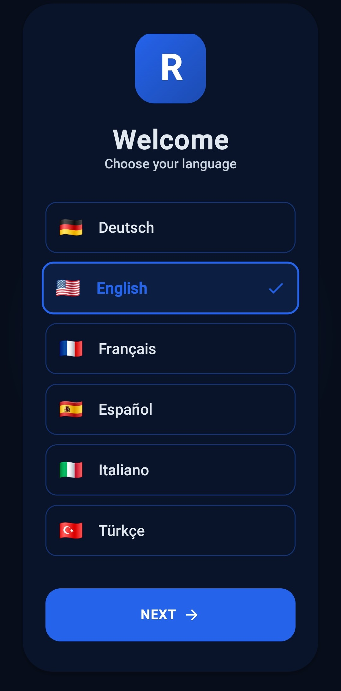

# 📨 Richard - Local Network Messenger

**Richard** is an elegant, private messenger designed for your local network. It acts as your personal communication butler: once started on a PC, all devices within the same Wi-Fi network (smartphones, tablets, laptops) can chat instantly without requiring an internet connection.

---

## 📱 Mobile View & Interface

Richard was developed with a **Mobile-First approach**. The interface is fully responsive and feels like a native app on your smartphone.

| Chat History | Mobile Navigation |
| :---: | :---: |
|  |  |
| *Optimized for thumb interaction* | *Sleek, adaptive design* |

---

## ✨ Highlights

* **Automatic IP Detection:** Richard instantly identifies the address (e.g., `192.168.178.50`) under which it is reachable in the network.
* **True Portability:** The entire system is compiled into **a single `.exe` file**. No installation, no database setups required.
* **Offline-First:** All data remains within your own network. No cloud, no tracking.
* **Cross-Platform:** Host on Windows and chat on iOS, Android, Linux, or macOS via any web browser.

---

## 🚀 Quick Start for Users

1.  **Run the EXE:** Open `richard.exe` on your primary computer.
2.  **Share the Address:** The program will display the local IP address (e.g., `http://192.168.178.50:5000`).
3.  **Connect:** Enter this address into the browser on your smartphone.
4.  **Pro Tip:** Select "Add to Home Screen" on your mobile browser to use Richard just like an installed app.

---

## 🛠 Development & Build Process

### Project Structure

```text
.
├── main.py            # Backend (Flask/Python)
├── richard.ico        # Application Icon
├── templates/         # HTML Structure (Responsive)
└── static/            # CSS Styles & JavaScript Logic
